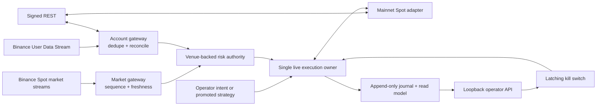

# Live Trading V1 Specification — Binance Spot

> **Status (2026-08-13, `live-v1` branch).** Implemented since this document
> was frozen: authority-typed mainnet endpoints and adapters (read/trade
> separated at the type level), the dedicated mainnet credential families,
> the read-only `live-reconcile` command, the one-shot operator-acknowledged
> `live-lifecycle` mainnet order owner (journal-first, query-first,
> `--max-notional` cap, kill-switch latch), and the capability manifest
> promotion to schema 4 with `release_stage: live-manual` and
> `live_trading_enabled: true`. Not yet delivered: the credentialed external
> evidence gates (continuous shadow observation, supervised canary evidence)
> and the strategy promotion gate — automated strategy execution remains
> unavailable. Statements below such as `release_stage=paper-only` describe
> the runtime as of 2026-08-12 and are preserved unchanged.

## 1. Document Control

| Field | Value |
| --- | --- |
| Status | Implementation-ready baseline; mainnet promotion remains gated |
| Version | 1.0 |
| Date | 2026-08-12 |
| Repository | `<repo-root>` |
| Product baseline | Binance Spot, one dedicated account, one symbol |
| Default symbol | `BTCUSDT` |
| Settlement asset | `USDT` |
| Leverage / borrowing | Forbidden in V1 |
| First mainnet action | Human-supervised, smallest exchange-valid limit-order lifecycle |
| Automated strategy | Disabled until a separate strategy-promotion gate passes |

This specification defines the minimum system that may eventually submit real
orders. It does not claim that any strategy is profitable. The latest frozen
offline experiment rejected every candidate, and the current runtime still
reports `release_stage=paper-only` and `live_trading_enabled=false`.

The baseline above is deliberately concrete so implementation can begin. If the
operator chooses another exchange, perpetuals, leverage, multiple symbols, or
arbitrage, this specification must be revised before the corresponding Goal is
launched.

## 2. Problem Statement

The repository has strong deterministic Paper and Binance Testnet foundations,
but it does not have a mainnet-authenticated adapter, real-time account/order
stream, venue-backed risk authority, continuous live owner, or an external
evidence package. Supplying an API key cannot bridge those architectural gaps.

The project also mixes production-facing code with validation, research, and
legacy surfaces. Deleting every non-live module would remove the very controls
needed to prove recovery and prevent regressions. The required outcome is
therefore a small live artifact, not a source repository stripped of test and
recovery tools.

## 3. Product Outcome

V1 is successful when all of the following are true:

1. A dedicated Binance Spot account can be observed continuously through
   authenticated REST and the User Data Stream.
2. `BTCUSDT` market data is real-time, sequence-aware, freshness-bounded, and
   fails closed on gaps or disconnects.
3. One journaled owner can submit, query, cancel, reconcile, and recover a Spot
   limit order without blind retries.
4. Admission uses exchange-backed balances, owned open orders, fills, fees, and
   symbol filters rather than Paper or synthetic account values.
5. A latching kill switch immediately blocks new risk and drives owned-order
   cancellation plus authoritative reconciliation.
6. The production binary contains only the selected venue/product and the
   operational components required for live trading.
7. Testnet, shadow-mainnet, backup/restore, restart, and supervised canary gates
   have durable redacted evidence.
8. Automated strategy execution remains unavailable until `STRATEGY_ID` is
   selected and passes an additional promotion gate.

## 4. Non-Goals

The following are out of scope for V1:

- Binance USD-M, COIN-M, margin, leverage, borrowing, liquidation, or funding.
- Hyperliquid or any second venue.
- Cross-venue or multi-leg arbitrage.
- Multiple symbols, multiple accounts, or active/active high availability.
- Market orders, OCO, cancel-replace, trailing, iceberg, SOR, or pegged orders.
- Deposits, withdrawals, transfers, sub-account administration, or custody.
- A claim of profitability or automatic promotion of Grid, Arbitrage, or Volume
  Maker.
- Rewriting the append-only journal into a database.
- Removing Testnet, Paper, replay, fault-injection, or reconciliation source
  code from the repository.

## 5. Current-State Evidence

- `rust/crates/runtime/src/capability.rs` emits `PaperOnly` and
  `live_trading_enabled=false`.
- `rust/crates/runtime/src/execution.rs` rejects `ExecutionMode::Live`.
- `rust/crates/exchange/src/unsupported.rs` is the only live exchange surface.
- `rust/crates/exchange/src/endpoint.rs` intentionally accepts Binance Testnet
  private endpoints, not Binance mainnet private endpoints.
- `BinanceTestnetExchange` supports bounded submit/query/cancel and
  reconciliation but has no private stream.
- public adapters use credential-free REST polling rather than production
  market streams.
- `runtime/account_risk.rs` is explicitly Paper-only.
- the latest release-readiness report records no credentialed Testnet evidence,
  no candidate strategy promotion, and no mainnet readiness.

These are starting conditions, not defects to bypass. Every authority increase
must be introduced behind new evidence and fail-closed contracts.

## 6. Safety Invariants

The following invariants are non-negotiable and must have tests:

1. **No implicit authority:** a read-only process cannot construct or call a
   trading transport. Testnet and mainnet credentials, endpoints, configuration
   types, binaries, and capability claims are distinct.
2. **Journal before side effect:** order intent and client identity are durable
   before submit or cancel network I/O.
3. **Query before retry:** timeout, disconnect, HTTP 5xx, Binance `-1007`, lost
   response, or process restart produces `outcome_unknown`; the next action is
   an authoritative query/reconciliation, never a blind resubmit.
4. **Venue truth wins:** balances, owned open orders, cumulative fills, fees,
   and instrument filters come from Binance. Local projections may reserve
   conservatively but cannot invent buying power.
5. **Stale means stopped:** stale market data, stale account state, a User Data
   Stream gap, unresolved foreign order, journal degradation, or clock/rate
   uncertainty blocks new risk.
6. **One writer:** exactly one live execution owner holds the journal/account
   writer lease. A contender fails immediately.
7. **Idempotent replay:** replaying duplicate REST responses, WebSocket events,
   fills, cancels, or reconciliation receipts cannot double-settle state.
8. **Spot cannot short:** sells are capped by authoritative free base balance
   minus conservative reservations.
9. **Kill is latching:** once engaged, the process cannot re-arm itself.
   Re-arming requires a clean restart, successful reconciliation, a fresh
   release preflight, and explicit operator action.
10. **Secrets are non-data:** secrets never enter CLI arguments, config files,
    journals, telemetry, screenshots, test fixtures, crash output, or Git.
11. **No unattended money movement:** Testnet mutation and all mainnet trading
    are human-supervised one-shot procedures. A recurring controller may
    coordinate but may not place or cancel external orders.
12. **No strategy by implication:** a working execution engine does not grant a
    strategy permission to trade.

## 7. Target Architecture



### 7.1 Deliverable binaries

| Binary | Purpose | Allowed authority |
| --- | --- | --- |
| `crypto-trading-live` | Selected Binance Spot production runtime | Mainnet read; mainnet trade only in promoted build and armed process |
| `crypto-trading-verify` | Paper, Testnet, fault injection, reconciliation, soak, restore drills | No mainnet trading |
| `crypto-trading-research` | Backtest, indicators, offline experiments | No external account or order authority |

If retaining the existing binary names during migration reduces risk, Cargo
features and dependency-graph assertions may establish the same boundaries
first. The final release artifact must nevertheless expose one unambiguous live
entry point.

## 8. Authority and Configuration Model

### 8.1 Explicit environments

Use separate concrete types for `BinanceTestnet`, `BinanceMainnetRead`, and
`BinanceMainnetTrade`. A generic string URL must not determine authority.
Production accepts only exact official Binance Spot hosts; tests may use an
explicit literal loopback transport. Redirects to a different host are
rejected.

### 8.2 Credential separation

- Existing Testnet variables remain Testnet-only.
- Mainnet read credentials use dedicated variable names such as
  `BINANCE_MAINNET_READ_API_KEY` and `BINANCE_MAINNET_READ_API_SECRET`.
- Mainnet trade credentials use different variables such as
  `BINANCE_MAINNET_TRADE_API_KEY` and
  `BINANCE_MAINNET_TRADE_API_SECRET`.
- The live binary refuses to start when the same key identity is configured for
  read and trade roles.
- The trade key must have withdrawal disabled, IP restriction enabled, and be
  attached to a dedicated minimally funded account. These are operator evidence
  requirements, not values persisted by the program.
- Every secret-bearing type has redacted `Debug`/`Display`; error conversion and
  structured telemetry are tested with sentinel secrets.

### 8.3 Required live configuration

The live process fails closed unless all fields are present and valid:

| Field | V1 rule |
| --- | --- |
| `venue` | exactly `binance` |
| `product` | exactly `spot` |
| `symbols` | exactly one allowlisted symbol; baseline `BTCUSDT` |
| `account_id` | non-empty dedicated account identifier, never a secret |
| `order_types` | `LIMIT` and optionally `LIMIT_MAKER` only |
| `max_order_notional` | positive operator-approved Decimal |
| `max_gross_notional` | positive and not below max order notional |
| `max_position_base` | positive Decimal |
| `max_open_orders` | V1 hard upper bound `1` during canary |
| `max_daily_realized_loss` | positive operator-approved Decimal |
| `max_consecutive_execution_errors` | bounded positive integer |
| `market_data_max_age_ms` | default 2,000; hard upper bound 5,000 |
| `account_state_max_age_ms` | default 2,000; hard upper bound 5,000 |
| `request_timeout_ms` | bounded and below the owner operation deadline |
| `journal_path` / `journal_id` | absolute private path and explicit generation UUID |
| `release_evidence_id` | immutable identifier of the accepted gate package |
| `strategy_id` | absent for manual canary; exact promoted ID afterward |

Numeric values use `Decimal`; floating point is forbidden for monetary and
quantity decisions. Unknown fields, duplicate keys, mixed environments, or a
configuration that is broader than the release manifest are errors.

## 9. Market Data Requirements

### FR-MD-01 Real-time top of book

Subscribe to the Binance Spot individual-symbol book-ticker stream for the
exact configured symbol. Preserve venue event/sequence fields when provided,
plus local receive time and connection generation.

### FR-MD-02 Optional depth

Diff-depth/local-book support is required only before a promoted strategy uses
depth. If implemented, bootstrap from an authoritative snapshot, enforce update
ID continuity, discard pre-snapshot events correctly, and rebuild after every
gap. A partial or crossed local book is degraded, never tradable.

### FR-MD-03 Connection lifecycle

Handle ping/pong, server-mandated connection rotation, bounded exponential
backoff with jitter, subscription acknowledgement, and clean shutdown. Queues
are bounded; overflow marks the stream degraded and requires a rebuild.

### FR-MD-04 Freshness gate

No order may be admitted without a fresh same-generation market observation.
Disconnect, age breach, sequence gap, decode error burst, or reconnect blocks
new orders before the next intent is evaluated.

## 10. Account and Order Data Requirements

### FR-AD-01 User Data Stream

Subscribe through the supported Binance Spot WebSocket API using the read
credential. Consume account balance updates and `executionReport` order events.
Record event time, transaction time, order ID, client order ID, execution type,
status, last and cumulative quantities, cumulative quote quantity, commission,
commission asset, and trade ID when present.

### FR-AD-02 Dedupe and ordering

Events are idempotent by stable venue identity and monotonic cumulative state.
Duplicate, delayed, and reordered events may advance a projection only when
they provide strictly newer authoritative information. Regression is rejected
and triggers reconciliation.

### FR-AD-03 Reconciliation

At startup, after reconnect, after an ambiguous operation, periodically while
armed, and before re-arming after a kill, query authoritative account balances,
owned open orders, and every unresolved client order ID. Two stable samples or
an equivalent authoritative watermark are required before state becomes ready.

### FR-AD-04 Foreign activity

An order not attributable to this release/account owner is a foreign order.
The default policy is fail closed and require operator resolution; the process
must not cancel or adopt it automatically.

## 11. Mainnet Order Adapter Requirements

V1 supports only:

- create one `LIMIT` or `LIMIT_MAKER` Spot order;
- query by persisted client order ID and venue order ID when known;
- cancel the exact owned order;
- list owned/unresolved open orders for reconciliation.

Before submit, the adapter validates current authoritative `exchangeInfo`
status, price, quantity, precision, notional, and all locally supported filter
semantics. Unknown or newly introduced required filters fail closed.

The adapter must:

1. generate a durable globally unique client ID before transport;
2. bind venue, product, account, symbol, side, price, quantity, order type, and
   time-in-force into the intent identity;
3. use a bounded receive window and clock-skew correction contract;
4. retain Binance weight/order-count headers and durable `Retry-After` deadlines;
5. classify timeout, HTTP 5xx, connection loss after dispatch, and `-1007` as
   unknown outcome;
6. quarantine further submits until authoritative reconciliation advances;
7. never interpret an HTTP error alone as proof that no order exists.

## 12. Order State Machine

Allowed durable states:

```text
planned
  -> submit_dispatched
  -> acknowledged_open | partially_filled | filled | rejected | expired
  -> outcome_unknown -> reconciling -> acknowledged_open | partially_filled |
     filled | rejected | expired | recovery_required

acknowledged_open | partially_filled
  -> cancel_planned -> cancel_dispatched
  -> cancelled | filled | expired | outcome_unknown
```

Rules:

- network I/O never precedes the corresponding planned fact;
- terminal venue states never regress;
- cumulative filled quantity and quote quantity never decrease;
- commissions are settled once per unique trade identity;
- a partial fill reserves only the authoritative remainder while settling the
  filled portion exactly once;
- a process killed at any state resumes from journal and queries first;
- unresolved ambiguity ends in `recovery_required`, not success.

## 13. Venue-Backed Risk Authority

Admission input consists of a fresh market observation, a fresh account
snapshot, owned open-order reservations, unsettled/reconciled fills, current
instrument rules, and the proposed exact intent.

V1 enforces:

- symbol/account/product allowlists;
- one in-flight/open order maximum during canary;
- maximum order notional, gross notional, and base position;
- quote buying power after fees and conservative reservations;
- no Spot short and no sell beyond free base capacity;
- daily realized loss including venue-reported commissions;
- maximum consecutive adapter/stream errors;
- stale market/account refusal;
- foreign-order and unresolved-operation quarantine;
- pause and latching kill-switch refusal;
- a smallest-valid-order canary whose notional cannot exceed the approved cap;
  if Binance minimum notional exceeds the cap, the canary fails closed.

The risk decision and all inputs needed to explain it are journaled without
secrets. Missing fee information is handled conservatively; it is never
assumed to be zero.

## 14. Live Owner, Recovery, and Kill Switch

### 14.1 Single live owner

The owner acquires the journal/account writer lease, replays the full durable
chain, reconciles exchange state, starts both streams, proves freshness, and
only then becomes `ready_unarmed`. Starting in `armed` or submitting during
bootstrap is forbidden.

### 14.2 Arming

Arming requires all of:

- a promoted live build and matching release evidence ID;
- capability manifest says `mainnet_canary` or `live` for the exact scope;
- clean journal replay and current reconciliation;
- healthy market and account streams;
- exact operator acknowledgement containing account, symbol, cap, and expiry;
- an acknowledgement expiry of at most one process session.

### 14.3 Kill switch

Kill switch engagement is journaled and locally blocks new orders before any
network action. The owner then:

1. freezes strategy/operator admissions;
2. enumerates exact owned open orders;
3. plans and dispatches bounded cancellations;
4. queries every ambiguous cancel/order;
5. performs full account reconciliation;
6. reports `killed_clean` only when no owned open order remains;
7. otherwise reports `recovery_required` and stays latched.

Automatic liquidation is not part of V1. Selling held Spot assets requires a
separate explicit operator flatten intent and the same risk/order contracts.

### 14.4 Restart and disaster recovery

The release gate includes process kill/restart at each meaningful order state,
journal backup/restore, corrupted/truncated-tail detection, writer contention,
and loss/reordering of stream events. No drill edits or truncates production
evidence.

## 15. Operator Control Plane and Observability

The live operator API remains loopback-only behind mandatory bearer
authentication. The live binary must not expose the compatibility option that
permits an unauthenticated read API.

Required projections:

- build version, binary hash, release evidence ID, environment, product,
  account ID, symbol, and exact authority;
- lifecycle state: `booting`, `reconciling`, `ready_unarmed`, `armed`,
  `degraded`, `recovery_required`, `killed_clean`;
- market/user stream generation, age, reconnects, gaps, queue pressure;
- REST latency, status classes, Binance weights, order counts, backoff deadline;
- balances, owned open orders, reservations, position, commissions, realized
  PnL, and risk headroom;
- every order state transition and unresolved operation;
- kill-switch state and cancellation/reconciliation progress.

Health must distinguish process liveness from trading readiness. A process can
be live but unready; load balancers or automation must not infer order authority
from HTTP 200 alone. Logs are structured, bounded, redacted, and never contain
request signatures or secrets.

## 16. Production Packaging and Pruning

### 16.1 Excluded from `crypto-trading-live`

- `backtest` and `indicators`;
- Paper exchange and Paper strategy owners;
- Testnet lifecycle/reconciliation/soak commands;
- scanners, price alerts, replay-only monitors, and Volume Maker unless selected
  later;
- Hyperliquid and every config-only venue;
- research artifacts and legacy Python;
- UI pages unrelated to health, capabilities, executions, risk, recovery,
  settings, and kill switch.

Cargo dependency-tree and CLI/help snapshot tests prove these surfaces are not
linked or reachable in the live artifact.

### 16.2 Retained in repository and verification artifact

- Binance Testnet adapter and lifecycle owner;
- Paper exchange/account as deterministic test doubles;
- replay, journal validation, fault injection, reconciliation, and soak tools;
- backtest and indicators in the optional research artifact;
- release reports and redacted evidence manifests.

### 16.3 Archive candidate

`archive/python-legacy/` may move to a separate archive repository after its
build/reference status is documented. It is not part of the Rust production
build and must not block V1.

## 17. Deployment Requirements

- immutable image digest and recorded binary SHA-256;
- read-only root filesystem and dropped Linux capabilities;
- one private persistent journal mount with restrictive permissions;
- secrets injected at process start, never baked into image or `.env` in Git;
- loopback operator API; any remote access requires a separately reviewed TLS
  reverse proxy and authentication boundary;
- host time synchronization monitored; excessive skew blocks signed requests;
- graceful shutdown stops admission, cancels or preserves ownership state as
  configured, reconciles, flushes journal, and exits within a bounded deadline;
- rollback reuses the same journal generation and never truncates history;
- only one live replica may hold the writer/venue-owner lease.

## 18. Verification Strategy

### 18.1 Deterministic local gates

- unit and contract tests for every parser, signature vector, filter, state
  transition, risk invariant, dedupe rule, and redaction path;
- property/state-machine tests for duplicate, delayed, missing, and reordered
  events;
- loopback transport tests for timeouts, connection loss, 4xx, 5xx, `-1007`,
  clock skew, 429/418, and malformed/oversized responses;
- process restart tests after every planned/dispatched/observed transition;
- writer contention, journal corruption, backup/restore, and kill-switch tests;
- dependency-graph and CLI/API reachability tests for binary pruning;
- Rust format, check, strict Clippy, workspace tests, doc tests, release build,
  dependency audit, diff hygiene, and secret-pattern scan;
- frontend frozen install, lint, typecheck, tests, build, audit, and operator-flow
  browser tests.

### 18.2 Supervised Binance Testnet gates

Using Testnet-only credentials supplied locally through environment variables:

1. limit order becomes open and is cancelled;
2. controlled partial fill settles exactly once and remainder is cancelled;
3. process kill after submit resumes by query-first without duplicate submit;
4. ambiguous submit and cancel recover through signed query;
5. authoritative account reconciliation is clean;
6. 24-hour soak includes stream/REST probes, one forced termination/restart,
   and clean stop;
7. journal backup/restore reproduces the same projection.

### 18.3 Mainnet read-only shadow gate

With a separate `USER_DATA` key that cannot trade:

- run at least 24 hours with market and account streams plus periodic REST
  reconciliation;
- observe zero unauthorized mutation attempts;
- prove reconnect, stream rotation, freshness, rate-limit, and clock handling;
- compare stream-derived balances/orders with stable REST snapshots;
- fail the gate on any unexplained divergence, foreign order, gap, secret leak,
  or unbounded resource growth.

### 18.4 Mainnet canary gate

This gate is never launched by an unattended controller. A human supplies the
trade key locally, reviews the redacted preflight, and authorizes one exact
order intent. The canary uses the smallest exchange-valid notional within the
operator-approved cap, one order only, no market order, no strategy loop, and a
bounded cancel/reconcile deadline. Any ambiguity stops the campaign and enters
recovery; it does not retry by creating a new order.

## 19. Promotion Stages

| Stage | Authority | Required evidence |
| --- | --- | --- |
| `paper_only` | Local Paper only | Current baseline |
| `testnet_candidate` | Binance Testnet mutation | Local gates + supervised Testnet lifecycle |
| `mainnet_shadow` | Mainnet public and private read only | Testnet package + read-key security evidence |
| `mainnet_canary` | One exact operator-authorized Spot lifecycle | Shadow soak + independent promotion review |
| `live_manual` | Bounded operator intents | Successful canary + rollback/recovery review |
| `live_strategy` | One exact promoted strategy | Separate strategy evidence and explicit operator approval |

Capability manifests must be build- and scope-specific. Test, Paper, and
research binaries never advertise mainnet authority. No stage is inferred from
the mere presence of credentials.

## 20. Release Evidence Manifest

Every promotion package records:

- Git commit and dirty-state policy;
- binary/image digest and dependency lock hashes;
- redacted configuration fingerprint and exact scope;
- capability manifest;
- test commands and results;
- Testnet/shadow/canary journal and output hashes;
- reconnect, restart, reconciliation, backup/restore, and kill-switch evidence;
- known limitations and unresolved risks;
- reviewer identity/date and operator approval date;
- expiry or revocation reason.

The manifest contains no key, secret, signature, raw environment dump, or full
account identifier.

## 21. Acceptance Criteria

V1 platform acceptance requires every statement below:

- **AC-01:** the live binary cannot link or route to Paper, Testnet, research,
  unused strategy, or unused venue execution paths.
- **AC-02:** a read-only build/process cannot construct mainnet trade authority.
- **AC-03:** startup performs journal replay and authoritative reconciliation
  before readiness.
- **AC-04:** public and private streams are bounded, reconnecting,
  freshness-aware, and fail closed on gaps.
- **AC-05:** order intent is durable before I/O; all ambiguous outcomes recover
  query-first without duplicate submit.
- **AC-06:** partial fills, commissions, cancellations, duplicate events, and
  terminal states settle idempotently.
- **AC-07:** risk uses venue truth and enforces the complete V1 limit set.
- **AC-08:** kill switch blocks admission immediately, cancels exact owned
  orders, reconciles, and stays latched.
- **AC-09:** secrets are absent from arguments, files, logs, journals, fixtures,
  telemetry, errors, and Git scans.
- **AC-10:** deterministic local, supervised Testnet, and 24-hour mainnet shadow
  gates have immutable redacted evidence.
- **AC-11:** an independent review finds no unresolved critical/high finding and
  confirms the capability manifest matches actual authority.
- **AC-12:** the first mainnet canary completes or fails safely with no duplicate
  order and a reconciled final account state.
- **AC-13:** automated strategy authority remains unavailable while
  `STRATEGY_ID` is unset or lacks a promotion artifact.

## 22. Rollback and Incident Policy

- Stop new admission first; do not destroy state to obtain a clean dashboard.
- Engage the latching kill switch when account/market truth is uncertain.
- Cancel only orders proven to be owned by this release.
- Query and reconcile ambiguous operations until terminal or explicitly
  `recovery_required`.
- Preserve journal, process logs, redacted API receipts, build hashes, and the
  exact configuration fingerprint.
- Roll back the binary/image while retaining the journal generation.
- Rotate/revoke the trade key if credential exposure is suspected.
- A foreign order, balance divergence, unexpected fill, duplicate order,
  journal integrity failure, or secret exposure is a release-stopping incident.

## 23. Open Operator Inputs

The implementation baseline may proceed with the defaults, but promotion cannot
proceed until the operator supplies:

1. confirmation or replacement of `Binance / Spot / BTCUSDT`;
2. dedicated account/sub-account identifier;
3. approved order, gross, position, and daily-loss caps;
4. IP allowlist and key-rotation/revocation evidence;
5. the strategy identifier for the later `live_strategy` stage;
6. explicit supervision windows for Testnet mutation and mainnet canary.

API keys themselves are never supplied in this document or a Goal prompt.

## 24. Normative References

- Repository capability source: `rust/crates/runtime/src/capability.rs`
- Exchange boundary: `rust/crates/exchange/src/lib.rs`
- Current Testnet recovery implementation:
  `rust/crates/apps/src/testnet_lifecycle.rs`
- Current release evidence: `docs/reports/release-readiness-2026-08-12.md`
- Current production-candidate procedures:
  `docs/runbooks/production-candidate.md`
- Binance Spot General REST API Information:
  <https://developers.binance.com/en/docs/products/spot/rest-api#general-api-information>
- Binance Spot User Data Stream:
  <https://developers.binance.com/en/docs/products/spot/user-data-stream>
- Binance Spot WebSocket Market Streams:
  <https://developers.binance.com/docs/binance-spot-api-docs/web-socket-streams>
- Binance Spot Trading Endpoints:
  <https://developers.binance.com/docs/binance-spot-api-docs/rest-api/trading-endpoints>

The official Binance documentation is normative for current protocol behavior.
Any conflict or undocumented behavior fails closed and requires a dated spec
amendment plus new contract evidence.
