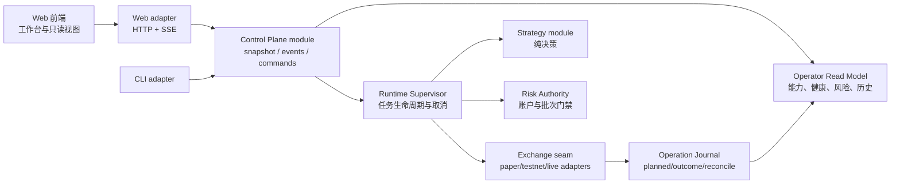

# Crypto Trading 全项目对齐、Web 控制面与 Goal 执行计划

> 状态：M3 进行中（M0、M1、M2 已完成）
>
> 日期：2026-07-24
>
> 目标：在保留 Rust 安全边界的前提下，补齐原 Python 项目真正需要的能力，并交付一个可审计、先只读后可控的 Web 工作台。

## 1. 已核验基线

### 1.1 证据范围

- 原项目：[`cryptocj520/crypto-trading-open@6207373`](https://github.com/cryptocj520/crypto-trading-open/tree/620737399bfe3c331f9989fc77d631536f2e89df)。
- Web 参考：[`shy3130/tickflow-stock-panel@60fe9e6`](https://github.com/shy3130/tickflow-stock-panel/tree/60fe9e6fa61dd774968d483cb8466b4b485e7ad0)。
- 当前 Rust 重构：本仓库 `rust/` 工作区。
- 完整外部证据与固定链接见
  [`docs/research/upstream-repository-alignment.md`](../research/upstream-repository-alignment.md)。

### 1.2 事实结论

1. `archive/python-legacy/` 与原项目固定提交逐文件 SHA-256 对比为
   **366 相同、0 变更、0 单边文件**。当前仓库已保留完整原项目，不需要再次迁移一份副本。
2. 原 Python 项目有 259 个 Python 文件、约 109,712 行；Rust 活跃工作区有
   73 个 Rust 文件、约 27,516 行，其中测试约 11,076 行。行数不能代表功能等价，
   但说明 Rust 当前是经过收敛的策略/执行内核，不是原系统的逐文件翻译。
3. Rust 配置目录共核验 60 份配置：

   | 分类 | 数量 | 含义 |
   | --- | ---: | --- |
   | `runtime-executable` | 2 | 当前 Rust 路径真正消费关键字段，可做 paper one-shot |
   | `legacy-parseable` | 49 | 仅兼容解析；仍有未消费字段或运行时缺失 |
   | `auxiliary` | 9 | 日志、映射、市场元数据或 companion 配置 |
   | `unsupported` | 0 | 当前检查样本中没有完全未知配置 |

   两份可执行配置是 `paper-once-btc.yaml` 与 `paper-once-eth.yaml`。
4. 清除旧 Cargo 增量产物后，Rust 1.85.0 全工作区
   `cargo test --workspace --all-targets --all-features --locked` 为
   **323 通过、0 失败**。旧产物曾制造“源码已导出但编译器看不到”和 5 个
   Binance 假失败，因此后续发布门禁必须包含干净构建验证。
5. 当前 Rust 的真实产品定位仍是：
   - 配置兼容与分类；
   - 确定性策略计算；
   - Grid / Arbitrage paper one-shot；
   - 受控执行历史与恢复上下文；
   - live / continuous / private adapter 失败关闭。
6. `tickflow-stock-panel` 值得借鉴的是本地自托管工作台、能力探测、分组导航、
   查询缓存、长任务进度和单容器交付；不能照搬 A 股业务、TickFlow 数据模型、
   巨型前端 facade 或后端全局状态组织方式。

## 2. 对齐差距矩阵

| 领域 | 原 Python 项目 | Rust 当前状态 | 目标状态 | 优先级 |
| --- | --- | --- | --- | --- |
| Grid | 连续网格、普通/马丁/移动、剥头皮、本金保护、止盈止损 | 配置与纯策略较完整；仅显式价格驱动的 paper one-shot | 先做可恢复的连续 paper supervisor，再逐项恢复策略语义 | P0/P1 |
| Arbitrage | 价差/资金费率监控、分段、多腿、多交易所、自动补单 | 分段策略与双腿 paper one-shot；显式盘口、风险和历史 | 先连续只读监控，再 durable paper saga；多腿与 live 最后 | P0/P1 |
| Volume maker | Backpack 挂单、Lighter 市价、统计 UI | 配置/纯策略存在；运行时失败关闭 | 独立 paper/compliance 模式；不得混入默认 live 路径 | P2 |
| Price alert | 连续监控、声音提醒、冷却/重复 | 配置/纯策略存在；运行时失败关闭 | 持久事件、去重、冷却、非阻塞通知 adapter | P1 |
| Scanner | 虚拟网格、APR/波动率排行、终端 UI | 虚拟网格算法存在；CLI 只做有界文件检查 | 离线确定性扫描、排行与 Web 展示 | P1 |
| Exchanges | 9 个 Python adapter 家族，质量与生产安全未独立证明 | PaperExchange；Binance public；Binance/Hyperliquid testnet 协议 seam；live 关闭 | 发布明确支持矩阵；一次只打通一个经 testnet/reconcile 验证的 adapter | P0 |
| Account/Risk | 多类 guard、深度、reduce-only、错误避让 | 精确产品级风险较强；缺账户总风险、现金/保证金真相源和跨进程 reservation | 权威账户快照、批次/账户总敞口、reservation、kill switch | P0 |
| Recovery | Python 有重试/补单路径，但缺统一可证明语义 | planned/completed/partial/incomplete JSONL 较强 | durable cursor、重启恢复、幂等、对账、补偿决策 | P0 |
| Runtime | 多脚本 + `tmux` 连续进程 | 单 CLI，连续命令失败关闭 | 有界 supervisor、优雅关闭、健康探测、任务状态 | P0/P1 |
| Web | 无正式 Web 产品 | 无 Web crate / frontend | 先只读运营控制面，再开放严格授权的 paper 操作 | P1 |
| Deployment | 脚本与多环境依赖 | Rust 二进制/CI，尚无完整运行编排 | 单机自托管、持久卷、健康检查、显式 secrets、保守重启 | P1 |

### 不追求的“伪对齐”

- 不把 Python 的备份文件、宽接口、静默异常或未实现路径翻译到 Rust。
- 不因 YAML 能解析就宣称策略可运行。
- 不以“9 个 adapter 文件存在”替代签名向量、testnet、对账与故障恢复证明。
- 不让 Web 按钮绕过 CLI/runtime 已有的 live 失败关闭与风险确认。
- 不把 paper 盈亏解释为真实收益；手续费、资金费率、滑点、队列和市场冲击未建模前必须明确标注。

## 3. 目标架构：核心与控制面分离



### 3.1 深模块与 seam

1. **Control Plane module**
   - 外部 interface 初期只暴露：
     `snapshot()`、`events_after(cursor)`、`capabilities()`。
   - 后期只增加一个受控 `submit(command)`，命令必须携带幂等键、权限上下文和风险确认。
   - Web 与 CLI 都跨同一个 seam，禁止 Web 自己读取内部文件或直接构造 exchange adapter。
2. **Operator Read Model module**
   - 把 JSONL 历史、supervisor 状态、adapter 健康、配置分类和风险状态收敛为稳定视图。
   - 输入可以来自 journal adapter 与内存事件 adapter；这两个 adapter 让 seam 成为真实可测 seam。
3. **Runtime Supervisor module**
   - 隐藏循环、退避、取消、任务状态、资源上限和优雅关闭。
   - interface 以“启动/停止一个有 ID 的任务 + 查询状态”为中心，不把内部 actor/channel 暴露给调用方。
4. **Risk Authority module**
   - 从当前逐产品门禁深化为账户快照、reservation、总毛/净敞口、订单限额、kill switch。
   - 风险结果必须是可序列化、可审计的允许/拒绝，不以日志文本作为 interface。
5. **Operation Journal module**
   - 统一事件 envelope：版本、事件 ID、批次/任务 ID、时间、来源、序号、payload、校验信息。
   - 写入顺序继续保持 `planned` 先于外部副作用；重启恢复只依赖稳定 interface。

### 3.2 依赖方向

- `domain` 不依赖任何应用或传输层。
- `strategy` 只依赖 `domain` 与显式配置 adapter，不做 I/O。
- `exchange` 是第三方系统 seam；真实 adapter 与 deterministic adapter 满足同一 interface。
- `runtime` 依赖策略、风险和 exchange seam，拥有执行编排。
- `control-plane` 读取 runtime/journal 的稳定视图，不反向渗入策略算法。
- Web backend 是 control-plane 的 adapter；前端不接触凭证和私有 exchange 请求。

## 4. Web 产品计划

### 4.1 信息架构

| 页面 | 首版职责 | 明确不做 |
| --- | --- | --- |
| Overview | 运行模式、能力矩阵、数据新鲜度、任务/adapter 健康、最近异常 | 不展示虚构收益，不提供 live 快捷开关 |
| Markets | watchlist、标准 symbol、exchange 映射、BBO/深度新鲜度 | 不把单一 BBO 包装成完整市场深度 |
| Strategies | Grid/Arbitrage/Alert/Scanner 配置、可用性、paper 结果 | 不允许未消费字段的 legacy 配置直接启动 |
| Executions | batch、legs、receipts、partial/incomplete、reconcile 上下文 | 不提供“无脑重试” |
| Risk | 账户/产品限额、reservation、kill switch、拒绝时间线 | P0 未完成前只读 |
| Alerts | 规则、触发、冷却、确认状态、通知交付结果 | 通知失败不得阻塞交易/监控 |
| Replay | 历史快照、策略版本、决策与执行回放 | 不宣称为真实撮合回测 |
| Integrations | adapter 能力矩阵、testnet 状态、symbol/rule catalog | 配置存在不等于 adapter 可用 |
| Settings | 数据目录、日志、通知、只读凭证状态、主题 | Web 不返回 secret 明文 |

### 4.2 首个垂直切片

首版只读切片必须同时贯通：

1. Rust `Control Plane` snapshot。
2. `GET /api/v1/system`、`GET /api/v1/capabilities`、
   `GET /api/v1/executions?cursor=...`。
3. `GET /api/v1/events` 的 SSE 心跳与游标恢复。
4. Web shell 的 Overview、Executions、Integrations 三页。
5. 加载、空、错误、过期数据和权限不足状态。
6. 一个从固定 JSONL fixture 启动的离线端到端测试。

任何写操作、凭证编辑、live 开关都不进入首个切片。

### 4.3 设计诊断（Phase 1）

**设计读取：面向单一操作者的交易运行与审计驾驶舱，用专业、克制、风险优先的语言，
倾向金融精致与开发者原生的深色工作台。**

- 视觉冒险度 4/10：结构清晰、少量非对称，不让视觉创意抢走风险信息。
- 动效强度 3/10：只为状态变化、抽屉、任务进度和危险确认提供反馈。
- 信息密度 8/10：桌面端是驾驶舱，但通过分组、固定数字列和可折叠详情控制噪声。

功能契约：

- 3 秒内必须看见 paper/live 模式、kill switch、数据新鲜度、adapter 健康和未恢复异常。
- 必须能定位一批执行的计划、每条腿、回执、对账与下一步。
- 危险操作必须二次确认；live 仍由 runtime 门禁决定，UI 不得扩大授权。
- 空态、加载态、错误态、过期态和部分失败态都属于正常产品状态。

从 TickFlow 借鉴：

- 持久左侧分组导航与固定的全局状态区。
- 图表、表格、事件流和详情抽屉的组合。
- capability-gated UI、任务进度、深链筛选与本地低风险偏好。
- 深色中性底、等宽数字、红/绿/橙/蓝固定语义。

必须改掉：

- A 股页面与词汇、过多全局状态、极小字号和“每块数据都做卡片”。
- 让侧栏承担业务状态真相源。
- 大量装饰渐变、玻璃拟态和无意义 hover。
- 把 alert toast 当作 durable 事件记录。

Phase 2 将生成四个可交互方向样机并等待选择，正式前端代码必须在用户选定方向后开始。
候选家族：

1. **金融精确**：Kraken/Coinbase 式风险优先、线框分区、低饱和蓝。
2. **Operator Terminal**：Warp/Superhuman 式快捷、等宽遥测、紧凑事件流。
3. **审计账簿**：IBM Carbon 式全宽 blotter、无圆角、可打印证据链。
4. **静默事件舱**：低认知负担的事件时间线主从布局，一次聚焦一项恢复工作。

## 5. 分阶段执行路线

### M0：基线与迁移账本

交付：

- [x] 把三仓能力矩阵变成机器可检查的 `capabilities` 清单。
- [x] 为 60 份配置记录 `parseable / executable / consumed-fields / runtime` 状态。
- [x] 发布 adapter 支持矩阵：public data / testnet protocol / authenticated /
  reconcile / live。
- [x] CI 增加可重复的干净构建检查，避免旧增量产物假阴性。

退出条件：

- 任何页面、CLI 和文档都从同一能力清单生成或验证。
- 全量 Rust 门禁在干净 target 下通过。

当前进度（2026-07-24）：

- [x] 建立版本化 capability schema、运行时单一事实源，以及 CLI 人类/JSON 两种输出。
- [x] 用契约测试锁定 `paper-only`、`live_trading_enabled=false` 和未授权能力失败关闭。
- [x] `config-check config --json` 稳定输出 60 条迁移账本，并由端到端测试锁定数量和代表性状态。
- [x] adapter 验证证据、CLI、README 和文档矩阵均接入同一能力清单；
  Web Integrations 页被约束为后续消费同一 manifest。
- [x] 在全新 Windows worktree 与起始不存在的独立 target 中通过 `fmt`、
  workspace `check`、`clippy -D warnings`、323 个 workspace tests、doc tests、
  release build 与 `cargo audit`；CI 中 RustSec audit 保持独立、与 target 无关的门禁。

### M1：Journal 与 Operator Read Model

交付：

- [x] 稳定版本化事件 envelope 与 cursor。
- [x] 从现有 execution JSONL 构建 bounded read model。
- [x] 处理损坏尾行、重复事件、超限记录、游标过期和跨进程读取。
- [x] snapshot/history interface 的 deterministic adapter 与 fixture。

退出条件：

- 同一 fixture 在 Windows/Linux 得到相同 snapshot。
- partial/incomplete 批次能给出明确恢复状态，且不会生成“直接重试”建议。

当前进度（2026-07-24）：

- [x] `OperationEventEnvelope` v1 以 journal sequence 作为唯一排序权威，
  固化 schema、journal/event/aggregate 身份、producer、payload 预算和非认证的
  FNV-1a64 损坏检测。
- [x] `JournalCursor` v1 固化 generation、last sequence/event 与 next byte offset，
  不编码路径、inode 或 wall clock；FNV 只检测意外变更，reader 仍必须验证边界锚点。
- [x] bounded file/in-memory reader 在读取前冻结快照长度，以稀疏 checkpoint 限制
  cursor anchor 恢复扫描；跨进程追加可恢复，改写锚点、损坏中段和超限记录失败关闭。
- [x] `OperatorReadModel` 将 planned/completed/partial/incomplete/failed 映射为稳定恢复
  状态；冲突冻结首个可信终态事实，不暴露原始错误文本，也不生成“直接重试”建议。
- [x] 容量窗口只淘汰日志序列最老的 completed 批次；所有未决与冲突批次必须保留，
  无安全淘汰候选时明确失败。
- [x] 建立只读 Control Plane snapshot/events interface 与
  HTTP/SSE contract；正式 Web 实现前先生成四个设计方向并等待选择。

### M2：Control Plane 与只读 Web 切片

交付：

- [x] Control Plane 深模块及合约测试。
- [x] 只读 HTTP/SSE adapter。
- [x] Phase 2 四方向设计预览、用户选择、项目级 `DESIGN.md`。
- [x] Overview / Executions / Integrations 首版。
- [x] loopback 默认绑定、可选访问认证、CSP/安全 headers、secret redaction。

退出条件：

- [x] 离线 fixture 端到端可用；断流重连可从 cursor 恢复。
- [x] UI 在桌面与移动端完成加载/空/错误/过期/部分失败验收。
- [x] 任何 HTTP 调用都不能构造 live authority。

当前进度（2026-07-24）：

- [x] 新增独立 `crypto-trading-control-plane` 只读 crate；trusted bootstrap 只注入
  `Arc<JournalSnapshotSource + Send + Sync>`，外部 adapter 不接触路径或执行原语。
- [x] `snapshot()` 与 `capabilities()` 保持确定性和 capability 单一事实源；
  `events_after(cursor)` 只返回 bounded event notice 与 opaque cursor，不向 transport
  透传 journal payload。
- [x] 新增独立 `crypto-trading-web` adapter；`system / capabilities / executions`
  只依赖 `Arc<ReadControlPlane>`，同步 journal 投影统一进入 `spawn_blocking`，默认
  只允许 loopback，并可选启用不会进入 `Debug` 的 bounded bearer token。
- [x] `snapshot_with_events_after()` 在同一 journal generation 内生成 operator projection
  与 cursor watermark，避免 HTTP 响应出现“投影领先于水位”的竞态。
- [x] `/api/v1/events` 以一个完整 event page 对应一个 SSE message 与页末 `id`；
  支持 `Last-Event-ID` 恢复、冲突 resume 位置预握手拒绝、bounded catch-up、心跳，
  以及握手后一次安全错误通知再终止。
- [x] HTTP/SSE 契约测试覆盖 security headers、鉴权、错误脱敏、secret/payload
  redaction、原子页和断点恢复；架构与安全只读复核均无剩余 P0–P3。
- [x] 已生成金融精确、Operator Terminal、审计账簿、静默事件舱四个可交互方向；
  桌面双列、窄屏单列、三组实时拨盘、唯一选择按钮和二次确认均已验收，
  250 CSS px 高缩放窄屏也无横向溢出。
- [x] 用户在预览中选定 A「金融精确」结构，并要求叠加 B 的开发者原生字体与 C 的
  审计账簿配色；选择已持久化到 `selection.json`，项目级 `DESIGN.md` 已成为视觉单一事实源。
- [x] 新增独立 `crypto-trading-web-app` composition root：只接收显式 journal 路径与
  durable generation UUID，只绑定 loopback，可从环境变量名称启用 bearer；不存在 live flag
  或命令路由。
- [x] 嵌入同源、无外部依赖的中文优先 Web shell；Overview / Executions / Integrations
  共用 capability manifest、coherent execution snapshot 与 fetch-stream SSE，opaque cursor 和
  bearer token 只保存在页面内存。
- [x] 真实浏览器已覆盖完整、空、source error、陈旧、partial/recovery、Bearer、
  抽屉键盘流与 token 清除；390 CSS px 与桌面均无横向溢出，最终 release 构建页面
  console error 为 0。
- [x] 认证会话换绑/清除会同步销毁受保护 read model、cursor 与 SSE 状态，并以
  session generation 丢弃旧认证成功响应和旧 401；终审无剩余 P0–P3。
- [x] M2 发布门禁：全工作区 fmt/check/clippy/test/doc-test/release build 与
  `cargo audit` 全部通过；`control-plane.web` 已由能力单一事实源提升为 `read-only`。
- [x] 当前 tracer-bullet：进入 M3，先统一只读 market-data provider 与 freshness
  契约，再用一个 deterministic/offline source 打通连续 monitor 事件。

### M3：连续只读监控、Alert 与 Scanner

交付：

- [x] 统一 market-data provider 能力与 freshness。
- [ ] Arbitrage monitor 连续只读事件。
- [ ] Price alert 冷却、去重、确认和持久化。
- [ ] Virtual-grid scanner 的确定性排行。
- [ ] 非阻塞通知 adapter；至少一个本地 adapter 和一个 deterministic adapter。

首条 tracer 证据（不等同于 M3 全部完成）：

- [x] `runtime::market_data` 固化 exact instrument universe、注入时钟、fresh/stale/future、
  revision/timestamp/receipt 顺序、source gap/unavailable 与同 generation 双腿读取；内存、
  universe 和事件数均有硬上限。
- [x] deterministic replay 与现有 bounded subscription bridge 均跨同一 seam；断线、重复、
  乱序、revision gap、timestamp rollback、慢消费者 lag 和延迟恢复均有合约测试。
- [x] `monitor --replay` 以严格 JSONL allowlist 连续产生只读套利事件；完整处理成功后才追加
  bounded journal，且没有 order intent、exchange handle 或 execution policy 权限；首条 tracer
  明确只接受恰好两个交易所，多所配置失败关闭而不静默截断。
- [x] monitor journal read model 与 execution projection 从同一冻结 snapshot 生成；
  `/api/v1/monitor` 和 Overview 只展示安全投影，并明确“历史最后事件不代表当前行情新鲜”。
  Execution SSE 只标记为“操作通知已连接”，不得把 monitor 抬升为“实时/新鲜”。
- [x] Web 真实浏览器复核覆盖桌面与 250 CSS px 极窄视口；长交易对和小数证据完整换行，
  页面无横向溢出、应用自身 console error 为 0。

第二条 tracer 证据（仍不等同于 M3 全部完成）：

- [x] `BinancePublicPollingSource` 复用无凭证 Binance Spot public HTTP adapter，并要求
  canonical instrument 与 wire symbol 的显式、有界、一一映射；非 Binance、非 Spot、
  重复 instrument 或重复 wire symbol 均在发起网络请求前失败关闭。
- [x] 远端 429/5xx/invalid payload 只生成 `SourceUnavailable`，不伪造行情；确定性指数退避
  有一小时硬上限，恢复成功后才递增 revision，并重新通过现有 freshness/continuity book。
- [x] source-neutral `MarketSupervisor` 隐藏 task/watch/select 细节，只暴露
  `start / next_event / status / stop`；latest-value retention 为 O(1)，慢消费者先收到显式
  `SourceGap` 再收到最新事件，请求进行中和长退避均可在 bounded grace 内取消。
- [ ] 后续 tracer：把真实 source 组合进可审计的多 venue monitor 与 durable task projection，
  再完成 Price Alert、Virtual-grid Scanner、通知 adapter；完成这些之前 M3 保持未退出。

退出条件：

- [x] 网络断开、乱序、重复、过期行情和慢消费者均有测试。
- [ ] 通知失败只影响通知状态，不影响监控主循环。

### M4：连续 Paper Supervisor

交付：

- [ ] Grid continuous paper 状态机。
- [ ] Arbitrage durable paper saga。
- [ ] 任务启动/取消、优雅关闭、重启恢复、幂等键。
- [ ] 账户级 paper ledger、pending reservation、费用/资金费率/滑点模型的明确版本。
- [ ] Web 只开放 paper 命令，命令回读结果必须来自 journal/read model。

退出条件：

- kill -9 / restart、单腿成交、超时、撤单不确定、对账失败均有恢复 fixture。
- 不重复提交；不完整执行不会被 UI 或 CLI 自动重试。

### M5：单交易所 Testnet 纵向打通

顺序：

1. 选择一个 adapter，不并行宣称多所可用。
2. 完成官方签名向量和最小权限凭证。
3. 下单、查询、撤单、部分成交、断线恢复、限流与时钟偏差。
4. 权威余额/持仓/开放订单对账。
5. 长时间 testnet soak 与人工恢复演练。

退出条件：

- adapter 支持矩阵的每个勾选都有固定测试或 testnet 证据。
- 主网 authority 仍关闭；testnet 通过不自动开放主网。

### M6：生产候选与部署

交付：

- [ ] 单二进制或明确的 backend/frontend 构建产物。
- [ ] Docker/Compose、持久卷、只读配置、显式 secret injection、健康检查。
- [ ] 日志轮转、备份/恢复、升级/回滚说明。
- [ ] Web 访问控制、审计日志、CSRF/CORS/限流。
- [ ] 运维 runbook 与故障演练。

主网上线额外门禁：

- [ ] 用户再次明确授权具体交易所、账户与限额。
- [ ] 安全审查和独立代码审查完成。
- [ ] 账户级风险、kill switch、对账、幂等、恢复和监控全部通过。
- [ ] 先小额 canary，且可立即回滚。

## 6. 测试与完成定义

### Rust 门禁

```powershell
cargo +1.85.0 fmt --all -- --check
cargo +1.85.0 check --workspace --all-targets --all-features --locked
cargo +1.85.0 clippy --workspace --all-targets --all-features --locked -- -D warnings
cargo +1.85.0 test --workspace --all-targets --all-features --locked
cargo +1.85.0 test --doc --workspace --all-features --locked
cargo +1.85.0 build --release --workspace --all-features --locked
cargo audit --file Cargo.lock
```

### Web 门禁

- 类型检查、lint、单元测试、路由/数据状态测试、生产构建。
- HTTP 合约测试、SSE 断流/游标测试、安全 header 与 redaction 测试。
- Playwright 或等价真实浏览器覆盖：桌面、移动端、键盘、focus、reduced motion。
- 截图两轮评审：艺术层级、工程状态、3 秒风险识别。

### 系统门禁

- 固定 fixture 的 CLI、HTTP、Web 三个 adapter 观察到一致事实。
- 模糊/部分执行必须保持 batch/leg/reconcile 恢复上下文。
- 任何未实现能力在 capability 清单、CLI 和 Web 中一致失败关闭。
- 没有 secret 出现在日志、JSON、错误页、浏览器状态或测试 snapshot。
- 文档中的每个“可用”都有测试或环境证据；没有证据只允许写“待验证”。

## 7. Goal 模式执行约束

Goal objective：

> 按本计划完成 Rust 项目与原 Python 项目的能力对齐，并交付安全的 Web 控制面；
> 从 M0 开始逐个满足退出条件，live 始终失败关闭，直到主网上线额外门禁和用户授权全部成立。

执行纪律：

1. 每轮只推进一个可独立验证的 tracer-bullet。
2. 优先完成 M0 → M1 → M2 的只读路径；不能用 UI 先行掩盖缺少的事实源。
3. 任何新增依赖必须服务于当前纵向切片，并在提交中记录选择与拒绝方案。
4. 保留当前工作树已有改动；只提交本 Goal 明确拥有的文件。
5. 正式 UI 实现遵守设计 Phase 2 选择门禁。
6. 每个里程碑结束运行对应全量门禁与代码审查。
7. 不以 token、时间或“代码已写完”作为完成；只以退出条件和验证证据作为完成。

## 8. 立即执行顺序

1. 固化本计划与研究报告。
2. 建立 M0 `capabilities` 清单的 schema 与回归测试。
3. 从当前 CLI 配置分类生成首份能力快照。
4. 为 adapter 支持矩阵补测试事实。
5. 开始 M1 的 event envelope / cursor 设计与测试。
6. 到达 Web 视觉实现前，生成 Phase 2 四方向交互预览并等待选择。
